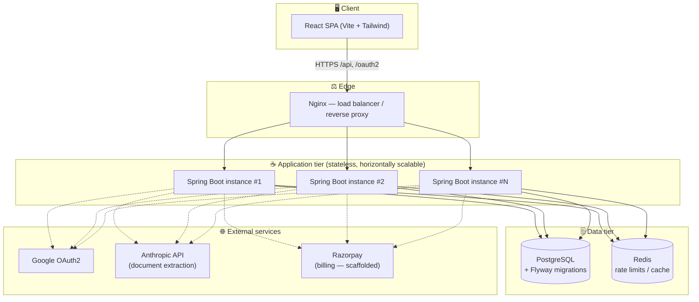
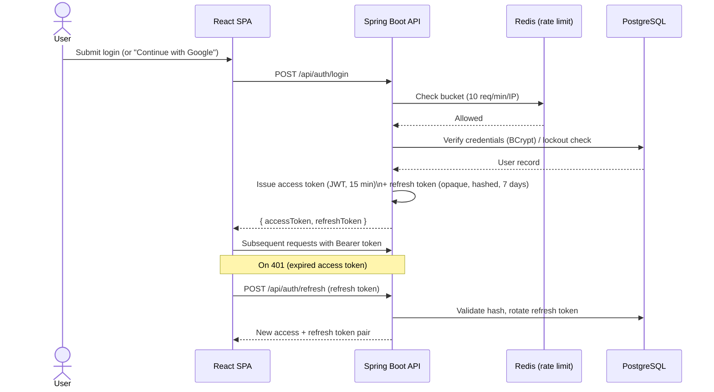
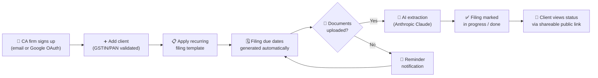

<div align="center">

# 📊 Raki - AI Practice Assistant for CA Firms

### A production-shaped SaaS platform for chartered accountants & tax consultants in India

[](https://git.io/typing-svg)

[](#)
[](#)
[](#)
[](#)
[](#)
[](#)
[](#-license)
[](CONTRIBUTING.md)
[](SECURITY.md)

</div>

---

A production-shaped starter for a subscription SaaS serving chartered
accountants and tax consultants in India: client management, filing/deadline
tracking, document uploads, AI-assisted document extraction, and a
subscription billing scaffold — built on **Java 17 + Spring Boot 3** and
**React + Tailwind**.

This is a **real, working skeleton**, not a mockup: auth, JWT, rate limiting,
Google OAuth, and the client/filing/document CRUD flows all function end to
end against a Postgres + Redis backend. What's stubbed rather than fully wired
is called out explicitly below (payment gateway, email delivery, WhatsApp,
object storage) so you know exactly what to plug in before going live.

## 📑 Table of contents

- [Stack](#-stack)
- [Features](#-features)
- [Architecture](#-architecture)
- [Workflows](#-workflows)
- [Quick start](#-quick-start-local-development)
- [Environment variables](#-environment-variables)
- [Google OAuth2 setup](#-google-oauth2-setup)
- [API surface](#-api-surface)
- [Security features implemented](#-security-features-implemented)
- [Horizontal scaling](#-horizontal-scaling--designed-in-not-bolted-on)
- [Project structure](#-project-structure)
- [Testing](#-testing)
- [Contributing](#-contributing)
- [License](#-license)
- [What's next](#-whats-next-explicitly-out-of-scope-for-this-starter)

---

## 🧱 Stack

| Layer                    | Choice                                                                       |
|---------------------------|-------------------------------------------------------------------------------|
| Backend                  | Java 17, Spring Boot 3.3, Spring Security, Spring Data JPA                    |
| Auth                     | Stateless JWT (access token) + rotating opaque refresh token, Google OAuth2   |
| Database                 | PostgreSQL + Flyway migrations                                                |
| Caching / rate limiting  | Redis (Bucket4j)                                                              |
| AI                       | Anthropic Claude (document data extraction pipeline)                         |
| Frontend                 | React 18, React Router, Tailwind CSS, Axios, Recharts                        |
| Deployment               | Docker, docker-compose, Nginx (load balancer example)                        |

## ✨ Features

- 👥 **Client management** — CRUD, notes, shareable public status links per client
- 🗓️ **Filing & deadline tracking** — recurring filing templates, due-date reminders
- 📄 **Document uploads + AI extraction** — Anthropic-powered data extraction from uploaded documents
- 🔔 **Notifications** — in-app notification center
- 💬 **Support** — support tickets + live support chat
- 💳 **Billing scaffold** — plans, subscriptions, Razorpay-ready tables
- 📊 **Dashboard** — practice overview stats, fees-avoided metrics
- 🛡️ **Admin console** — operator visibility, gated by `ADMIN_USER_ID`
- 📤 **CSV export** — client/filing data export
- 📜 **Legal pages** — Terms, Privacy, Contact

---

## 🏗️ Architecture



Every application instance is stateless — no sticky sessions, no in-memory
rate-limit state — so scaling out is just adding replicas behind Nginx. See
[Horizontal scaling](#-horizontal-scaling--designed-in-not-bolted-on) below.

## 🔄 Workflows

### Authentication flow (JWT + refresh rotation)



### Client onboarding → filing lifecycle



---

## 🚀 Quick start (local development)

### 1. Backend

```bash
cd backend
cp .env.example .env      # fill in DB/Redis/Google/Razorpay/Anthropic values
docker compose up postgres redis -d   # or run Postgres/Redis yourself
./mvnw spring-boot:run
```

The API comes up on `http://localhost:8080`. Swagger UI is at
`http://localhost:8080/api-docs`.

### 2. Frontend

```bash
cd frontend
npm install
npm run dev
```

Opens on `http://localhost:5173` and proxies `/api` and `/oauth2` calls to
the backend automatically (see `vite.config.js`).

### 3. First login

Register a normal account from the sign-up page, or configure Google OAuth
(see below) to use "Continue with Google."

---

## 🔑 Environment variables

All backend configuration is externalized via `backend/.env` (copy from
`.env.example`). Key groups:

<details>
<summary><strong>Database & cache</strong></summary>

| Variable         | Purpose                                  |
|-------------------|-------------------------------------------|
| `DB_URL`          | JDBC connection string                    |
| `DB_USERNAME` / `DB_PASSWORD` | Postgres credentials           |
| `REDIS_HOST` / `REDIS_PORT` / `REDIS_PASSWORD` | Redis connection |

</details>

<details>
<summary><strong>Auth</strong></summary>

| Variable            | Purpose                                             |
|----------------------|--------------------------------------------------------|
| `JWT_SECRET`         | HS256 signing key — generate with `openssl rand -base64 48` |
| `JWT_ACCESS_EXPIRY`  | Access token lifetime in ms (default 15 min)         |
| `JWT_REFRESH_EXPIRY` | Refresh token lifetime in ms (default 7 days)        |
| `GOOGLE_CLIENT_ID` / `GOOGLE_CLIENT_SECRET` | Google OAuth2 app credentials |

</details>

<details>
<summary><strong>Integrations</strong></summary>

| Variable                | Purpose                                              |
|--------------------------|---------------------------------------------------------|
| `ANTHROPIC_API_KEY`      | Required — powers the AI document extraction pipeline   |
| `ANTHROPIC_MODEL`        | Defaults to `claude-sonnet-5`                            |
| `RAZORPAY_KEY_ID` / `RAZORPAY_KEY_SECRET` / `RAZORPAY_WEBHOOK_SECRET` | Billing (scaffolded, not fully wired) |

</details>

<details>
<summary><strong>App / networking</strong></summary>

| Variable                 | Purpose                                     |
|----------------------------|------------------------------------------------|
| `CORS_ALLOWED_ORIGINS`     | Explicit allow-list of frontend origins        |
| `FRONTEND_BASE_URL`        | Used to build absolute links (e.g. OAuth redirects) |
| `SERVER_PORT` / `LOG_LEVEL`| Standard Spring Boot server config             |
| `ADMIN_USER_ID`            | Your own user id — grants access to `/app/admin`; leave blank to disable |

</details>

---

## 🔐 Google OAuth2 setup

1. Go to [Google Cloud Console](https://console.cloud.google.com/) → APIs &
   Services → Credentials → Create OAuth client ID (type: Web application).
2. Authorized redirect URI: `http://localhost:8080/login/oauth2/code/google`
   (swap the host for your real domain in production).
3. Copy the client ID/secret into `backend/.env` as `GOOGLE_CLIENT_ID` /
   `GOOGLE_CLIENT_SECRET`.
4. Restart the backend. "Continue with Google" on the login/signup pages will
   now work end to end.

---

## 🌐 API surface

REST controllers under `backend/src/main/java/com/caagent/controller/`:

| Controller                    | Responsibility                                  |
|--------------------------------|--------------------------------------------------|
| `AuthController`               | Register, login, refresh, logout, password reset |
| `ClientController`             | Client CRUD                                      |
| `FilingController`             | Filing/deadline CRUD                             |
| `FilingTemplateController`     | Recurring filing templates                       |
| `DocumentController`           | Upload, list, AI extraction trigger              |
| `DashboardController`          | Practice overview stats                          |
| `SubscriptionController`       | Plans/subscription state                         |
| `PlanController`                | Available billing plans                          |
| `NotificationController`       | In-app notifications                             |
| `SupportTicketController`      | Support ticket CRUD                              |
| `SupportChatController`        | Live support chat                                |
| `PublicStatusController`       | Shareable read-only client status link           |
| `ContactController`            | Public contact form                              |
| `AdminController`              | Admin-only operator endpoints                    |
| `HealthController`             | Liveness/readiness probe                         |

Full interactive spec is served by Springdoc at `/api-docs` when the backend
is running.

---

## 🛡️ Security features implemented

- **SQL injection** — every query goes through Spring Data JPA / Hibernate
  (parameterized queries) or named-parameter native queries. No string
  concatenation into SQL anywhere in the codebase.
- **Input validation** — every request DTO (`RegisterRequest`, `ClientRequest`,
  `FilingRequest`, etc.) uses Jakarta Bean Validation with strict patterns
  (email format, GSTIN/PAN alphanumeric-only, phone format, length limits).
  Validation failures return a structured 400 with per-field messages.
- **Input sanitization** — free-text fields (client notes, filing notes) are
  passed through `InputSanitizer` (OWASP Java HTML Sanitizer) before being
  persisted, stripping any HTML/script content.
- **XSS defense in depth** — React escapes rendered text by default;
  `InputSanitizer.encodeForHtml` is available for any raw-HTML contexts,
  and the backend sends a strict `Content-Security-Policy` header.
- **JWT authentication** — short-lived (15 min default) HS256 access tokens
  signed with a server secret, validated on every request by `JwtAuthFilter`.
  A separate opaque, hashed, rotating **refresh token** (7 days default)
  handles long-lived sessions — the raw refresh token is never stored, only
  its SHA-256 hash, so a DB leak alone can't forge a session.
- **Password security** — BCrypt at strength 12, strict complexity
  requirements enforced server-side (`RegisterRequest`), account lockout
  after 5 failed attempts for 15 minutes (`AuthService`).
- **Rate limiting** — Redis-backed token buckets (Bucket4j) with a tight
  limit on `/api/auth/**` (10 req/min/IP) and a looser general limit
  elsewhere (100 req/min/IP). Backed by Redis specifically so the limits
  hold correctly across multiple horizontally-scaled instances — see below.
- **CORS** — explicit allow-list of origins, credentials-aware, restricted
  methods/headers.
- **Security headers** — CSP, X-Frame-Options (deny), HSTS,
  Referrer-Policy: strict-origin-when-cross-origin.
- **File upload safety** — allow-list of content types, 15MB size cap,
  server-generated filenames (never trusting client-supplied names), and
  path-traversal checks before writing to disk.
- **Least-privilege queries** — every client/filing/document lookup is scoped
  by `ownerId`, so one firm's account can never read another firm's data
  even if it guesses an ID.
- **Audit trail** — logins, registrations, and (extend as needed) plan
  changes and deletions are written to `audit_logs` asynchronously.
- **No stack traces leaked** — `server.error.include-*: never` plus a global
  exception handler that logs details server-side and returns only safe,
  generic messages to the client.

> 🧯 **Found a vulnerability?** Please don't open a public issue — see
> [SECURITY.md](SECURITY.md) for how to report it privately.

### What to add before real production use

- HTTPS termination (Nginx/ALB with a real TLS cert — the sample `nginx.conf`
  is HTTP-only for local demo purposes).
- A Web Application Firewall in front of the load balancer, if you want an
  extra layer beyond application-level protections.
- Secrets management (AWS Secrets Manager / GCP Secret Manager / Vault)
  instead of `.env` files.
- Real email delivery (verification emails, password reset) — not built yet.
- Razorpay webhook signature verification wired into a `PaymentController`
  (the `Subscription`/`PaymentEvent` tables are ready for it).
- Object storage (S3/GCS) instead of local disk for documents — swap the one
  method in `DocumentService.upload()`.

---

## 📈 Horizontal scaling — designed in, not bolted on

The app is **fully stateless**, which is what makes scaling out a matter of
adding replicas rather than rewriting code:

- **No server-side sessions.** Auth is JWT; any instance can validate any
  token using only the shared `JWT_SECRET`.
- **No in-memory rate-limit state.** Bucket4j buckets live in Redis, shared
  across every instance — so a client can't get extra quota just because a
  load balancer happened to spread their requests across 5 pods instead of 1.
- **No in-memory caches that would fragment.** Nothing assumes "the same
  instance will see this user's next request."
- **Externalized config.** Every environment-specific value (DB host, Redis
  host, secrets, CORS origins) comes from environment variables — the same
  Docker image runs identically whether it's instance #1 or #50.
- **Connection pooling is bounded per instance** (`DB_POOL_SIZE`, default 10)
  so adding replicas scales total DB connections predictably — tune this
  alongside your Postgres `max_connections`.

### Try it locally

```bash
cd backend
docker compose up --scale backend=3 --build
```

Nginx (`nginx.conf`) load-balances across however many `backend` containers
you start — zero code or config changes needed as you scale from 1 to 3 to 30.

### Moving to real infrastructure

The same principles map directly onto:

- **Kubernetes**: this becomes a `Deployment` with a `HorizontalPodAutoscaler`
  targeting CPU/memory; the `docker-compose` Nginx step becomes a `Service` +
  `Ingress`.
- **AWS**: ECS/Fargate service behind an Application Load Balancer, RDS
  Postgres, ElastiCache Redis — swap the `.env` values for the managed
  endpoints and nothing in the application code changes.
- **Database scaling** beyond vertical sizing: add a read replica for
  reporting-heavy queries (dashboard stats) once write load justifies it —
  the repository layer is already split cleanly enough to point read-only
  queries at a replica DataSource later.

---

## 📂 Project structure

```
backend/
  src/main/java/com/caagent/
    config/         Security, CORS, Redis wiring
    security/       JWT util, auth filter, OAuth2 success handler
    filter/         Redis-backed rate limiter
    model/          JPA entities
    repository/     Spring Data repositories
    dto/            Request/response records with validation
    service/        Business logic
    controller/     REST endpoints
    exception/      Global error handling
    util/           Input sanitization
  src/main/resources/
    application.yml
    db/migration/   Flyway SQL migrations (V1 → V8)
  src/test/         Backend test suite
  Dockerfile
  docker-compose.yml
  nginx.conf

frontend/
  src/
    api/            Axios client with JWT + refresh interceptor
    context/        Auth context/provider
    components/     Landing sections, dashboard widgets, filings, shared UI kit
    pages/          Route-level pages (landing, auth, dashboard/*, legal)
    data/           Static/reference data
    styles/         Tailwind entrypoint
    utils/          Shared helpers
```

---

## 🧪 Testing

```bash
# Backend
cd backend
./mvnw test

# Frontend
cd frontend
npm run lint
```

The backend test suite is currently minimal — contributions that add
coverage around `AuthService`, rate limiting, and the document extraction
pipeline are especially welcome (see below).

---

## 🤝 Contributing

Contributions, bug reports, and suggestions are welcome. See
**[CONTRIBUTING.md](CONTRIBUTING.md)** for the full guide — dev setup,
coding conventions, the PR checklist, and how issues/PRs are reviewed.

Quick version: fork → branch off `main` → keep the PR focused → run
`./mvnw test` and `npm run lint && npm run build` → open a PR explaining
*why*, not just *what*.

For security-sensitive reports, use **[SECURITY.md](SECURITY.md)** instead
of a public issue.

---

## 📜 License

This project is **proprietary — all rights reserved**. No license is granted
to use, copy, modify, or distribute this code without the explicit written
permission of the owner. If you've been given access to this repository for
review or evaluation purposes, that access does not itself grant any usage
rights beyond what was explicitly agreed.

---

## 🗺️ What's next (explicitly out of scope for this starter)

- Razorpay checkout + webhook handling (tables are ready; controller isn't fully wired)
- Email verification / password reset delivery (flow exists; real email sending isn't)
- WhatsApp Business API integration for client messaging
- Multi-seat team management UI (the `max_seats` field on `Plan` is modeled
  but not yet enforced/exposed)

This is intentionally a strong, secure foundation to build the differentiated
parts on top of — not a finished commercial product.
</content>
